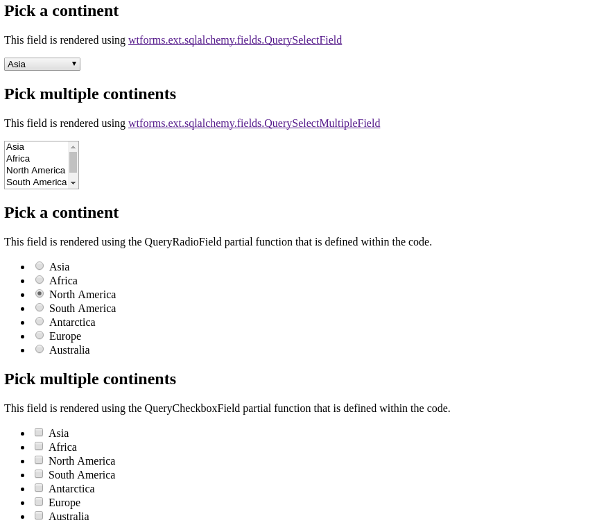

# QueryRadioField
A proof of concept for two classes that I believe
[`wtforms-sqlalchemy`](https://github.com/wtforms/wtforms-sqlalchemy) should
include:
* `QueryRadioField`
* `QueryCheckboxField`

They accomplish the same thing as the
[`QuerySelectField`](http://wtforms.simplecodes.com/docs/0.6/ext.html#module-wtforms.ext.sqlalchemy)
that already exists.

Created as a result of https://github.com/Code4SA/mma-dexter/issues/23

---

## Screenshot of basic implementation


Want to verify for yourself?
```
git clone git@github.com:brookskindle/queryradiofield.git
cd queryradiofield
pip install -r requirements.txt
export FLASK_APP=app.py
flask run
# go to http://localhost:5000
```
